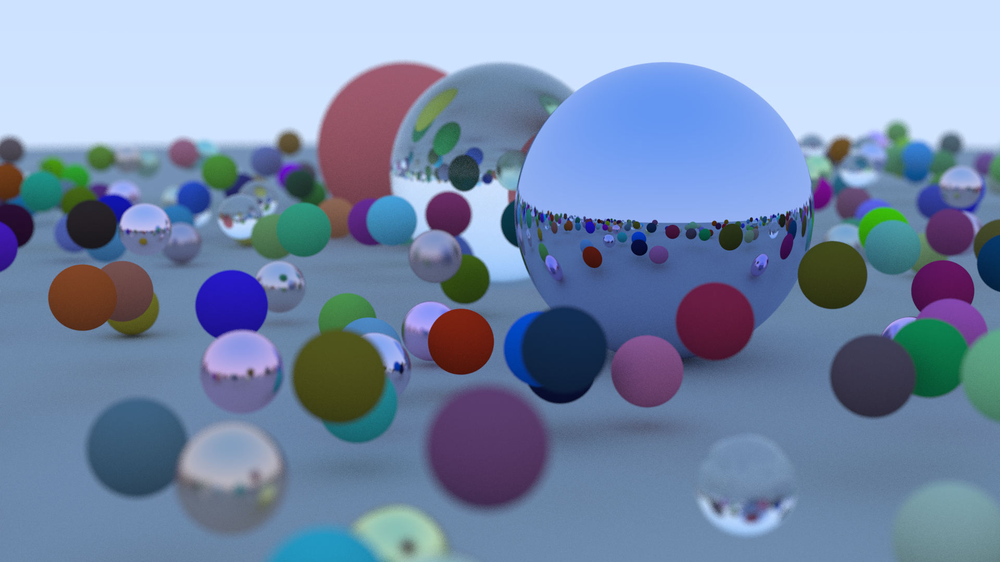

# C++ Raytracer



## Description

This is a C++ implementation of a raytracer, a computer graphics technique for simulating the way light interacts with objects to generate realistic images.
This raytracer supports features like basic shapes (spheres), reflections, shadows, and basic materials.

## Features

- Sphere primitive
- Materials (Matte, Specular, Dielectric)
- Shadows
- Reflections
- Anti-aliasing
- Depth of Field
- PNG output
- Multi-threading

## Getting Started

### Prerequisites

- C++17 or higher
- [CMake](https://cmake.org/download/) (for building)

### Building

1. Clone this repository:

   ```bash
   git clone https://github.com/PotatoPresident/Ray-Tracer
   cd Ray-Tracer
   ```

2. Create a build directory and generate build files with CMake:

   ```bash
   mkdir build
   cd build
   cmake ..
   ```

3. Build the project:

   ```bash
   cmake --build .
   ```

## Usage

```bash
./raytracer.exe
```

```bash
./raytracer.exe <image_width> <image_height> <samples_per_pixel> <max_depth> <threads>
```

### Options

- `image_width` : Set the width of the output image (default: 100).
- `image_height` : Set the height of the output image (default: 100).
- `samples_per_pixel` : Specify amount of samples for each pixel (default: 10).
- `max_depth` : Set the maximum amount of times a ray can bounce (default: 10).
- `threads` : Set the number of threads to use for rendering. Set to 0 to use maximum suggested (default: 0).

## Scene File Format

The scene file is a text file containing a description of the objects and their properties. Here is an example:

## Examples

```bash
./raytracer.exe
./raytracer.exe 1920 1080 100 50 0
```

## Acknowledgments

This project was inspired by [Peter Shirley's "Ray Tracing in One Weekend" series](https://raytracing.github.io/).

## License

This project is licensed under the MIT License - see the [LICENSE](LICENSE) file for details.
